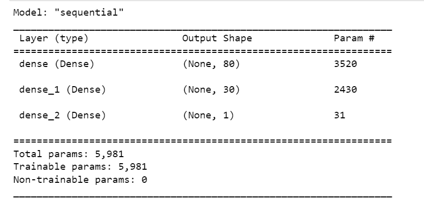
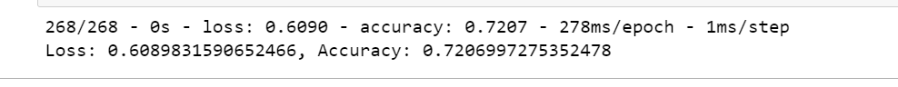
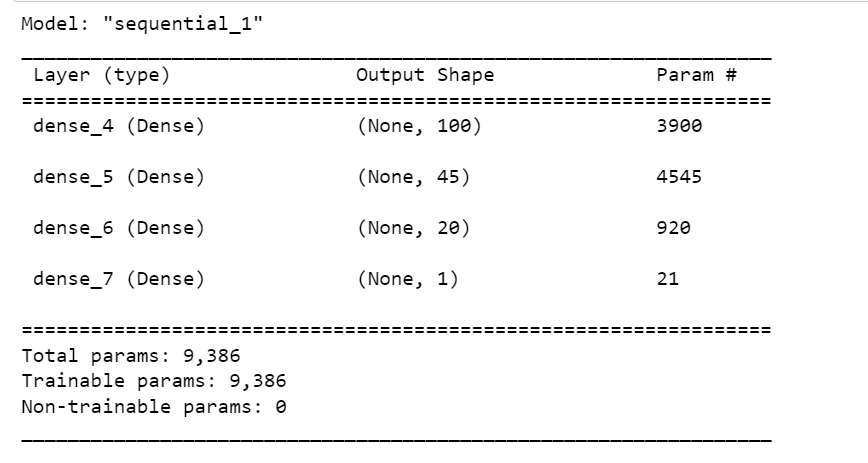
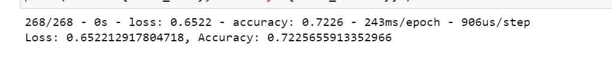
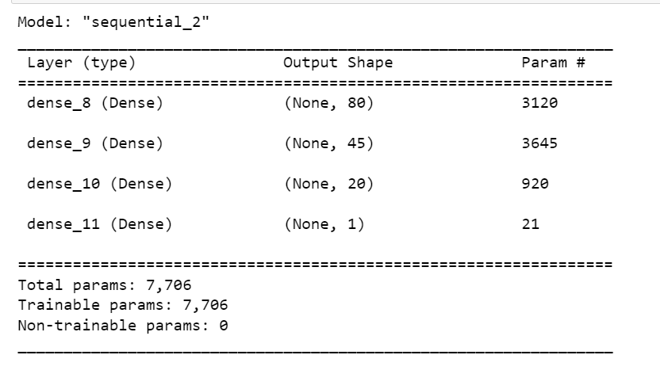
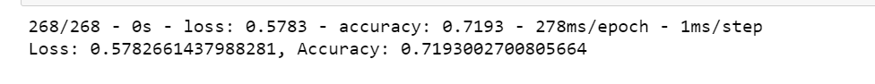

# Neural Network Charity Analysis

## Overview of the analysis

This project aims to use a neural network to evaluate a base of charities for the ones that will be successfully funded. Preprocessing step was done using Pandas and Scikit Learn. TensorFlow was the library used to create the neural network model.

## Results

- Data Preprocessing
    - The variable considered as a target by the model was IS_SUCCESSFUL, which states if the charity money we used effectively.
    - The feature variables were APPLICATION_TYPE, AFFILIATION, CLASSIFICATION, USE_CASE, ORGANIZATION, STATUS, INCOME_AMT, SPECIAL_CONSIDERATIONS, and ASK_AMT. The string columns were converted using OneHotEncoder.
    - The columns EIN and NAME were removed since they would not contribute to the predictions.

- Compiling, Training, and Evaluating the Model
    - Initially, the model was created with two hidden layers with 80 neurons on the first and 30 on the second, using relu as the activation function. The output layer was defined with one neuron and using sigmoid since a boolean answer was expected.
    - The attempts to optimize the model included creating a new hidden layer, with 10 neurons, using the relu activation function. After that, increasing the numbers of neurons on the second and third layers, to 45 and 20. The first layer was kept with 80 neurons because it was roughly double the features.  Lastly, the activation function in the third layer was changed to Tanh and the number of epochs was increased from 100 to 200.
    - None of the changes seemed to make a big difference in the results. In fact, the performance decreased slightly in each new intervention. Accuracy from the first model was 0.7249. After adding a new hidden layer was 0.7207, increasing the number of neurons gave an accuracy of 0.7226, and changing the activation function and increasing epochs resulted in 0.7193. Details can be seemed below:

    - Original model

    

    

    - First optimization attempt

    

    

    - Second optimization attempt

    

    

    - Third optimization attempt

    

    

    - Thus, it was not possible to achieve the desired 75% accuracy. With all results being around 72%.

## Summary 

As was stated before, even modifying the numbers of hidden layers, neurons, epochs, activation functions, or binning columns differently, the model did not present much improvement, resulting in 72% accuracy and 0.6 loss. Another possibility to solve this problem is to use ensemble models, like Random Forest since the data is tabular, and with enought depth and estimators this model could perform as well as a neural network.